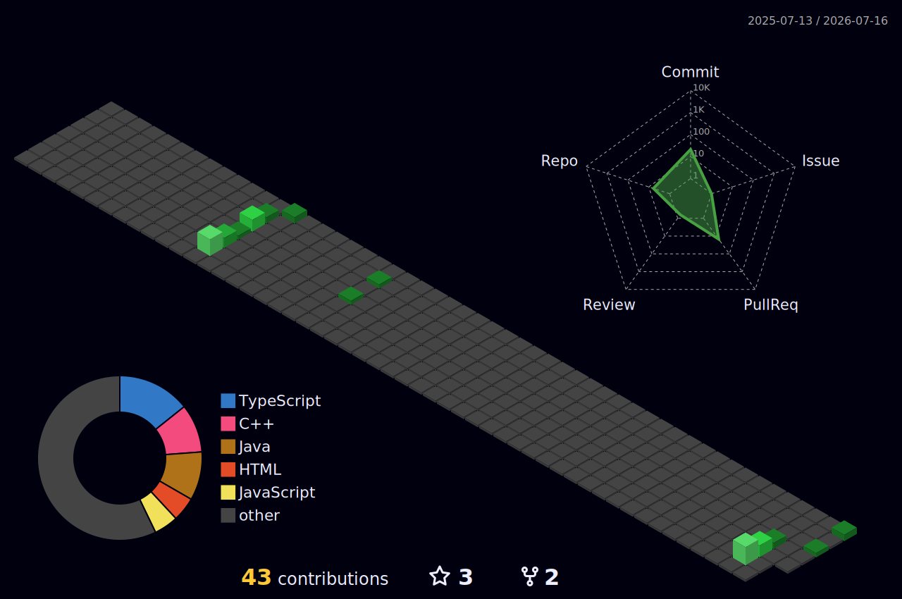

# Hi , I'm Nabeel Hussain 👨🏻‍💻

  
  
  

[![LinkedIn Badge](https://img.shields.io/badge/LinkedIn-0077b5?logo=data:image/svg+xml;base64,PHN2ZyB3aWR0aD0nMjU2JyBoZWlnaHQ9JzI1NicgeG1sbnM9J2h0dHA6Ly93d3cudzMub3JnLzIwMDAvc3ZnJyBwcmVzZXJ2ZUFzcGVjdFJhdGlvPSd4TWlkWU1pZCcgdmlld0JveD0nMCAwIDI1NiAyNTYnPjxwYXRoIGQ9J00yMTguMTIzIDIxOC4xMjdoLTM3LjkzMXYtNTkuNDAzYzAtMTQuMTY1LS4yNTMtMzIuNC0xOS43MjgtMzIuNC0xOS43NTYgMC0yMi43NzkgMTUuNDM0LTIyLjc3OSAzMS4zNjl2NjAuNDNoLTM3LjkzVjk1Ljk2N2gzNi40MTN2MTYuNjk0aC41MWEzOS45MDcgMzkuOTA3IDAgMCAxIDM1LjkyOC0xOS43MzNjMzguNDQ1IDAgNDUuNTMzIDI1LjI4OCA0NS41MzMgNTguMTg2bC0uMDE2IDY3LjAxM1pNNTYuOTU1IDc5LjI3Yy0xMi4xNTcuMDAyLTIyLjAxNC05Ljg1Mi0yMi4wMTYtMjIuMDA5LS4wMDItMTIuMTU3IDkuODUxLTIyLjAxNCAyMi4wMDgtMjIuMDE2IDEyLjE1Ny0uMDAzIDIyLjAxNCA5Ljg1MSAyMi4wMTYgMjIuMDA4QTIyLjAxMyAyMi4wMTMgMCAwIDEgNTYuOTU1IDc5LjI3bTE4Ljk2NiAxMzguODU4SDM3Ljk1Vjk1Ljk2N2gzNy45N3YxMjIuMTZaTTIzNy4wMzMuMDE4SDE4Ljg5QzguNTgtLjA5OC4xMjUgOC4xNjEtLjAwMSAxOC40NzF2MjE5LjA1M2MuMTIyIDEwLjMxNSA4LjU3NiAxOC41ODIgMTguODkgMTguNDc0aDIxOC4xNDRjMTAuMzM2LjEyOCAxOC44MjMtOC4xMzkgMTguOTY2LTE4LjQ3NFYxOC40NTRjLS4xNDctMTAuMzMtOC42MzUtMTguNTg4LTE4Ljk2Ni0xOC40NTMnIGZpbGw9JyNmZmYnLz48L3N2Zz4K)](https://www.linkedin.com/in/nabeel001/) 

## 😎 About Me:   

🏫 Graduate in Information Technology, from SSN College of Engineering.  
✨ Interested in Software Development, Data Science, Machine Learning and AI.  
🤝🏻 Open to project collaborations.  
 

## 🧰 Languages and Tools: 

 

 
 

## ⚡ GitHub Stats:

  

  
  

  

 
 
